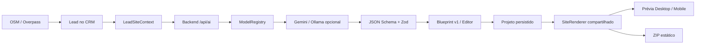

# Sites com IA — implementação e evidências

## Escopo e estado inicial

Auditoria anterior às alterações: [AI_SITE_AUDIT.md](AI_SITE_AUDIT.md). O radar e os stores eram reais; geração/publicação e prévias de sites continham simulações. O novo fluxo substitui essas simulações sem recriar CRM, prospector, configurações ou notificações.

## Arquitetura



O servidor recebe um snapshot validado porque o CRM atual persiste leads no navegador, não em banco no backend. Isso não autentica a identidade do estabelecimento. Dados do lead são tratados como dados não confiáveis no prompt.

## Arquivos e decisões

| Arquivo/área | Problema anterior → alteração |
|---|---|
| `server.ts`, `server/routes/siteGeneration.ts` | Texto livre → rotas validadas, limites de payload/concorrência, erros sanitizados, proteção de origem. Endpoint antigo retorna 410. |
| `server/services/ai/` | Seleção implícita → catálogo descoberto, adapters, structured output, tentativas limitadas e metadata real. |
| `server/schemas/generatedSiteSchema.ts`, `src/site-builder/types.ts` | Sem contrato → schemas estritos versionados. |
| `src/site-builder/context.ts` | Ausências/sugestões → canais omitidos, preços de IA descartados, testimonials proibidos. |
| `SiteGeneratorModal.tsx` | Timer e publish fictício → requisição real, projeto em geração/erro/gerado. |
| `VisualEditorView.tsx` | Customization parcial → Blueprint editável, seções, regeneração, salvar, revisar, exportar. |
| `ProjectsView.tsx`, `RedesenhoView.tsx` | Preview/antes fictícios → projeto real e informação disponível, sem métricas inventadas. |
| `SiteRenderer.tsx`, `SitePreview.tsx`, `exportSite.ts` | Mockups diferentes → HTML/CSS compartilhado, iframe isolado e ZIP sem dependências. |
| `leadStore.ts`, `projectPersistence.ts`, `types.ts` | Projeto sem site → Blueprint, contexto, status e metadata persistidos, erro de escrita explícito. |
| `toastStore.ts`, `ToastViewport.tsx`, `App.tsx` | Sem feedback efêmero → toasts acessíveis separados do histórico. |
| `GlobalCommandPalette.tsx`, `ContratosView.tsx` | Busca limitada → projetos e contratos com navegação contextual. |
| `tests/`, `openspec/`, documentação | Cobertura parcial → testes de contrato/integração e oito capacidades formalizadas. |

## Model Registry

Catálogo dinâmico: não há lista de versões fixas para a geração de sites. Exemplo observado com a credencial configurada no teste:

| ID | Provider | Model | Tier | Structured output | Estado |
|---|---|---|---|---|---|
| `gemini:gemini-2.5-flash` | Gemini | gemini-2.5-flash | quality | solicitado por JSON Schema | Geração real comprovada |
| `gemini:gemini-2.5-pro` | Gemini | gemini-2.5-pro | premium | configurado | Listado, não executado |
| `gemini:gemini-2.5-flash-lite` | Gemini | gemini-2.5-flash-lite | fast | configurado | Listado, não executado |
| `ollama:<modelo instalado>` | Ollama | descoberto em `/api/tags` | local | `format` schema | Opcional; não testado com modelo local |

O catálogo também retornou outras versões. Listagem não comprova disponibilidade operacional nem qualidade de todos os modelos. O filtro remove aliases/preview e famílias especializadas; capacidades são política do adapter, não resultado de um benchmark individual. Incompatibilidades retornadas pelo provedor resultam em erro, nunca em HTML arbitrário.

Automático prioriza qualidade para geração e rápido para regeneração, com até três candidatos e duas tentativas por candidato. Estratégias específicas usam um candidato; modelo explícito nunca troca por outro. `SITE_AI_DISABLED_MODELS` permite desabilitar IDs. Não há custos, créditos ou billing.

Referências: [Gemini Models API](https://ai.google.dev/api/models), [structured output Gemini](https://ai.google.dev/gemini-api/docs/structured-output), [structured output Ollama](https://docs.ollama.com/capabilities/structured-outputs), [OpenSpec CLI](https://github.com/Fission-AI/OpenSpec/blob/main/docs/cli.md).

## Evidências reais de runtime

Teste local no navegador Edge em 06/09/2026, concluído após meia-noite UTC:

1. Lead **Salão Renova**, já existente no CRM com origem OSM, foi usado na geração.
2. Reconsulta pelo proxy `/api/overpass` retornou HTTP 200, `node/1055833549`, nome Salão Renova, `shop=hairdresser`, latitude `-19.9196454`, longitude `-43.9477558` (base OSM `2026-09-07T02:16:21Z`). A reconsulta foi verificação independente; não se simulou uma nova inclusão no CRM.
3. Gemini **gemini-2.5-flash**, selecionado explicitamente na interface, gerou um Blueprint aceito pelo backend.
4. Projeto `proj-a97dcf5f-4914-4aaa-a119-d1ab5c4bf974` abriu no editor. Textos foram editados, sugestões não confirmadas removidas, SEO ajustado e revisão confirmada.
5. Após reload, título, conteúdo, ausência de serviços e modelo continuaram salvos. O teste de interrupção por recarregamento preservou um projeto anterior em erro, sem falso sucesso.
6. O botão exportou `site.zip` de verdade. ZIP contém `index.html`, `blueprint.json` e `context.json`.
7. O HTML do ZIP foi servido isoladamente em `127.0.0.1:3101`, fora do CRM, e aberto no navegador: nome, título, seção Sobre e navegação renderizaram, sem estrelas, contatos ou serviços fictícios. Não depende do servidor CRM, React no cliente ou CDN.
8. Regeneração real de headline com o mesmo Gemini explícito retornou novo título, manteve Sobre/SEO/cores/serviços e removeu a confirmação de revisão. O texto foi revisado novamente e salvo.
9. Prévia mobile inspecionada visualmente e medida no DOM: 390 px de largura, sem corte horizontal do conteúdo. Não equivale a teste em aparelho físico.
10. Busca por “Renova” retornou o lead e os dois projetos locais correspondentes. A categoria contratos estava vazia no perfil de teste; navegação com contrato existente não foi exercitada em runtime.

Não foi comprovada identidade empresarial no Google Maps nem confirmado funcionamento atual do salão: cadastro OSM não garante isso.

### Blueprint validado e revisado (exemplo do teste)

```json
{
  "version": 1,
  "templateId": "premium-service",
  "seo": {"title": "Salão Renova em Belo Horizonte", "description": "Conheça o Salão Renova, estabelecimento em Belo Horizonte."},
  "brand": {"primaryColor": "#2C3E50", "accentColor": "#BDC3C7", "tone": "moderno"},
  "hero": {"headline": "Salão Renova em Belo Horizonte", "subtitle": "Conheça o Salão Renova em Belo Horizonte.", "ctaText": "Saiba Mais", "ctaType": "none"},
  "about": {"title": "Sobre o Salão Renova", "description": "Salão Renova, estabelecimento cadastrado no OpenStreetMap em Belo Horizonte."},
  "services": [],
  "sections": {"hero": true, "about": true, "services": false, "contact": false, "location": false, "testimonials": false},
  "sectionOrder": ["hero", "about", "services", "location", "contact"],
  "warnings": ["Texto gerado por IA: revise as afirmações antes de exportar."]
}
```

## UX

### Refinamento responsivo do estúdio

Redesenho ganhou seletor destacado, cartão de presença atual e estado vazio de prévia, com estilos compartilhados em `src/site-builder/workspace.css`. Editor, projetos e modal receberam campos com foco visível e limites de largura; grades usam a largura do contêiner. Em teste Edge, larguras efetivas de 320, 416, 767 e 1280 px não geraram overflow horizontal. Foram inspecionados nome longo, editor e modal em 320 px, além do layout desktop. Aparelhos físicos não foram testados.

- Toasts: lead adicionado, site gerado/falha, seção regenerada/falha, projeto salvo/falha, ZIP exportado/falha, proposta/script gerado/falha. Histórico de notificações permanece separado.
- Busca: leads, páginas, ações, projetos e contratos; mantém Ctrl/Cmd+K. Não adiciona Context monolítico.
- Projetos antigos sem Blueprint não são apagados nem apresentados como sites novos válidos.
- Exportação exige revisão e aceitação/remoção das sugestões; não altera status para publicado.

## Validação automatizada

- `npm run lint`: aprovado (TypeScript).
- `npm test`: 18/18 aprovados. Providers simulados nos testes unitários, explicitamente separados da geração real acima.
- `npm run build`: aprovado; avisos de tamanho de chunks, import misto do store e comentários do Zod não bloqueantes.
- `openspec validate gerar-sites-com-ia-para-leads --strict`: aprovado.
- Cobertura: ausências, website/reputação, telefone distinto de WhatsApp, schema estrito, escape HTML, ordem, modelo inválido/desabilitado/incompatível, fallback automático e proibição de troca explícita, JSON inválido, merge parcial, reload/storage, ZIP e HTTP inválido/origem externa.

## Limitações e próximos passos

1. **Integridade semântica não é garantia automática.** A geração real escreveu copy promocional não comprovada. O teste revisou esses textos; prompt, schema e revisão obrigatória reduzem risco, mas não provam toda afirmação. Serviços seguem marcados como sugestões até confirmação. A regra absoluta de ausência→não inventar é aplicada a campos estruturados; a verificação semântica completa continua dependendo de revisão humana.
2. **Persistência local**, não sincronização multiusuário/banco. Limpar armazenamento remove projetos. ZIP contém contexto comercial fornecido; revise antes de compartilhar.
3. Ollama não foi executado nesta máquina. Regeneração de headline foi comprovada com Gemini; as outras seções têm cobertura da lógica de merge, não chamadas reais individuais. Disponibilidade e latência dependem do provedor.
4. Token compartilhado de servidor é proteção inicial, não sistema de autenticação multiusuário; adotar controle individual antes de exposição pública. BYOK legado no browser não é cofre.
5. Auditoria de dependências encontrou vulnerabilidades preexistentes (Express/body-parser/qs/uuid e xlsx). Não foram corrigidas nesta fase para não misturar migração de bibliotecas com o core. O alerta alto de xlsx não tem correção disponível no registro utilizado.
6. Deploy, billing, importação Excel, analytics e novos provedores ficaram fora do escopo. Outros fluxos legados não foram reescritos.
