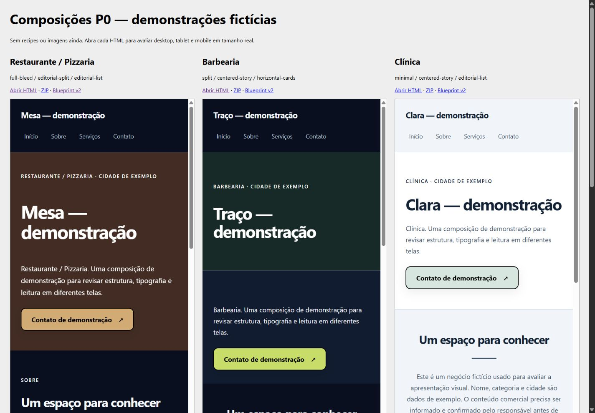

# Refinamento visual — referência Prospector CRM

Implementado a pedido do usuário após a revisão inicial de P0, usando a captura do CRM como referência visual e a skill ui-ux-pro-max. Não foi aplicada como instrução sobre conteúdo ou fatos empresariais.

- Superfícies sólidas com três níveis (fundo, conteúdo e blocos), em temas claro/escuro.
- Cores de marca preservadas; destaque do CTA usa accent com foreground calculado.
- Tipografia moderna de sistema consistente: removida a mistura obrigatória de Impact/Georgia/Arial entre variantes. Opção editorial disponível.
- Hierarquia de títulos, larguras de leitura, espaçamentos, bordas e radius alinhados. As variantes continuam usando estruturas diferentes.
- Entrada breve no título e apoio do Hero (560/640 ms), feedback de botão; nenhuma animação infinita, parallax ou script no export.
- `presentation` opcional no v2: theme light/dark, typography modern/editorial, motion none/subtle. V2 anterior e migração v1 continuam aceitos.
- Editor permite alterar tema, tipografia e animações. Geração respeita motion none no briefing; cinematic é limitado a subtle nesta etapa.
- `prefers-reduced-motion` desliga animações e transições. O conteúdo continua visível sem JavaScript.

Arquivos principais: `renderer/presentation.ts`, `renderer/SiteRenderer.tsx`, `types.ts`, `VisualEditorView.tsx`, `siteGeneratorService.ts`, `sitePromptBuilder.ts`. A direção da skill está registrada em `design-system/site-builder/MASTER.md`, com adaptações em `pages/generated-sites.md`.

Validação: 60 testes aprovados, TypeScript sem erros, build de cliente e servidor aprovado. Contraste >=4,5:1 testado para texto principal/secundário em todas as superfícies dos dois temas. Quinze combinações reais de navegador (cinco nichos em 1440/768/375) sem overflow horizontal: `refinement-responsive.json`. Animação `site-enter` confirmada no CSS computado do HTML exportado. A preferência de movimento reduzido está implementada e coberta estruturalmente; não houve alteração da configuração do sistema operacional para simular essa preferência.

Os HTMLs, JSONs e ZIPs nesta pasta foram atualizados. Os avisos de build continuam sendo tamanho de chunks, importação mista de leadStore e anotações PURE do Zod. A pendência anterior de homologação Blob/Nova aba no browser integrado permanece; não foi tentado contornar o bloqueio.

