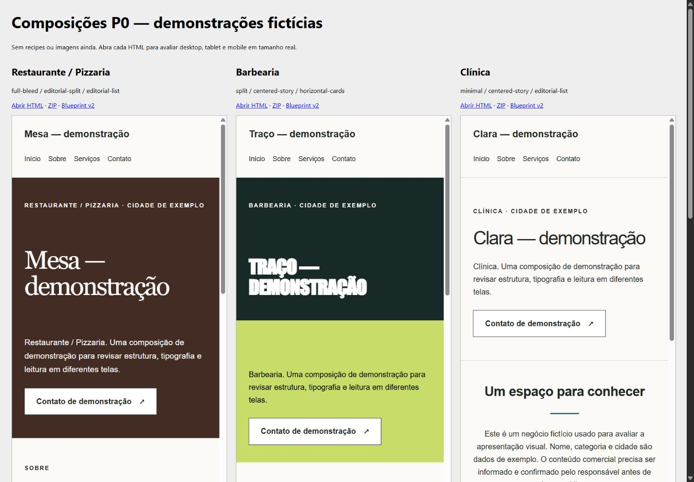

# P0 — renderer visual variável

Atualização: os exports desta pasta receberam o refinamento autorizado de contraste, tipografia e animações. Consulte `REFINAMENTO.md` para o estado mais recente (60 testes). O registro abaixo descreve a entrega inicial de P0.

Implementação entregue para revisão em 08/09/2026. P0 **ainda não está integralmente homologado**: o browser integrado bloqueia URLs Blob, impedindo a validação visual final do preview e de Nova aba. Nenhum trabalho de P1/P2/P3 foi iniciado.

## Auditoria antes de alterar código

Foram lidos o código atual, OpenSpec existente e os documentos Gap Analysis Visual, Roadmap de Refatoração Visual, Section Variant Registry e Anti AI Slop do Vault Design-Web. Confirmados GeneratedSiteBlueprint v1, DesignBrief, ModelSelection, SitePreview Desktop/Mobile, renderSiteDocument, renderer monolítico, siteCss global e diferenciação por CSS.

| Problema | Classificação | Arquivo / evidência inicial |
|---|---|---|
| Contrato sem escolhas estruturais | Schema issue | `src/site-builder/types.ts`: version literal 1, sem variants |
| Mesmo DOM nos templates | Renderer issue | `src/site-builder/renderer/SiteRenderer.tsx`: objeto `pieces` compartilhado |
| Preview sem tablet/fullscreen/nova aba | UX issue | `src/site-builder/components/SitePreview.tsx`: estado booleano mobile |
| Intenção visual sem contrato de composição | Prompt issue | `server/services/ai/sitePromptBuilder.ts`: instruções sem variantes permitidas |
| Ausência de mídia | Asset issue | Nenhum asset suportado no blueprint/renderer; adiado para P2 |
| Contraste em cores arbitrárias / novos layouts | Accessibility issue | Hero original sempre branco sobre cor personalizada; novas variantes precisavam comportamento mobile |
| CSS monolítico | Performance issue | Toda apresentação em uma string; agora base e estilos por seção, sem fontes externas |
| Links de fragmento saíam do site gerado | UX issue / Renderer issue | Teste real de Contato em srcDoc abriu a página do CRM dentro do iframe |

O arquivo `package-lock.json` já possuía alterações antes desta tarefa. Não foi editado por esta implementação. Nenhum deploy, instalação de provedor, nova chave ou chamada paga de IA foi realizado.

## Alterações

| Arquivo | Alteração |
|---|---|
| `src/site-builder/components/SitePreview.tsx` | Desktop 1440, Tablet 768, Mobile 390 com viewport real escalado; fullscreen nativo, fallback modal em portal, saída explícita/Escape na toolbar e foco restaurado; preview/nova aba por Blob com liberação de URLs |
| `src/site-builder/components/preview.css` | Toolbar responsiva e acessível, fullscreen e fallback CSS |
| `src/site-builder/types.ts` | Schema v1 preservado para leitura; schema v2 estrito; parser migra v1; defaults determinísticos por template |
| `src/site-builder/projectPersistence.ts` | Carregamento devolve blueprint normalizado v2; copy, contexto e revisão preservados |
| `server/schemas/generatedSiteSchema.ts` | JSON Schema enviado aos provedores usa apenas v2 |
| `server/services/ai/siteGeneratorService.ts` | Metadata registra a versão efetiva do blueprint |
| `server/services/ai/sitePromptBuilder.ts` | Lista variantes implementadas e solicita v2; alteração mínima para conectar P0 ao fluxo real |
| `src/site-builder/sections/registry.ts` | Registro explícito, cobertura tipada e fallback defensivo por template, depois fallback do registry |
| `src/site-builder/sections/{hero,about,services,contact,location,navigation,footer}/index.tsx` | Componentes distintos e CSS específico de cada seção |
| `src/site-builder/renderer/SiteRenderer.tsx` | Orquestra componentes em vez de conter o DOM de todas as seções |
| `src/site-builder/renderer/baseStyles.ts` | Estilos base, fontes locais, contraste de texto calculado, foco, skip link, reduced motion |
| `src/site-builder/exportSite.ts` | Mesmo fallback visual do preview; continua exigindo revisão e serviços aprovados |
| `src/components/VisualEditorView.tsx` | Seleção de composições com rótulos legíveis e atualização de defaults ao trocar template |
| `openspec/changes/site-builder-visual-p0/` | Auditoria, proposta, design, plano incremental e requisitos |

`SiteGeneratorModal`, `RedesenhoView` e o cliente de geração continuam usando o fluxo compartilhado existente; não precisaram de uma segunda implementação de renderer.

## Variantes disponíveis

| Seção | Variantes |
|---|---|
| Hero | `full-bleed`, `split`, `minimal` |
| About | `editorial-split`, `centered-story` |
| Services | `editorial-list`, `horizontal-cards` |
| Contact | `contact-minimal`, `contact-split` |
| Location | `location-editorial` |
| Navigation | `inline` |
| Footer | `minimal`, `editorial` |

Full-bleed é uma composição tipográfica de ponta a ponta em P0. Split divide título e conteúdo, com monograma decorativo. Nenhum deles apresenta imagem fictícia como foto do estabelecimento. About editorial separa título/prosa, sem placeholder de foto. Gallery, CTA independente e outras variantes não suportadas ficaram fora do schema.

Recipes implementadas: **nenhuma**, conforme limite P0. DNA v2, recipes, tokens completos, ImageIntent e Quality Gate permanecem em P1. MediaAsset e providers permanecem em P2. O template antigo orienta somente defaults determinísticos nesta fase.

## Exemplo v2

Trecho visual (o documento completo está em `restaurante.json`):

```json
{
  "version": 2,
  "templateId": "premium-service",
  "visual": {
    "hero": "full-bleed",
    "about": "editorial-split",
    "services": "editorial-list",
    "contact": "contact-split",
    "location": "location-editorial",
    "navigation": "inline",
    "footer": "editorial"
  }
}
```

Blueprints v1 recebem defaults por template. O parser rejeita v2 inválido no fluxo de geração. O renderer/export recupera variants ausentes ou desconhecidas sem aceitar cores injetadas, HTML arbitrário ou versões desconhecidas. Campos novos de recipes/mídia não são aceitos prematuramente.

## Resultados reais

| Validação | Resultado |
|---|---|
| `npm run lint` | Aprovado — TypeScript sem erros |
| `npm test` | **58 aprovados, 0 falhas, 0 ignorados** |
| `npm run build` | Frontend e servidor compilados |
| OpenSpec validate strict | Aprovado |
| Migração v1 | Quatro templates; conteúdo preservado; migração idempotente e persistência testadas |
| Variantes inválidas | Rejeição na geração; fallback no renderer e export testados |
| Diversidade DOM | Três estruturas de Hero; dois About; dois Services testados |
| Export | Cinco ZIPs; HTML idêntico byte a byte ao retorno do renderer; JSON v2 preservado |
| Factualidade | Contatos/WhatsApp/endereço ausentes omitidos; sugestões e revisão de export preservadas |
| Desktop / Tablet / Mobile | Cinco HTMLs abertos em 1440/768/390; 15 medições sem overflow horizontal em `responsive-results.json` |
| Fullscreen nativo | Entrada e saída explícita verificadas; Escape e foco na toolbar verificados |
| Fallback fullscreen | Diálogo modal e CSS; Escape fecha e restaura foco no botão |
| Preview inicial srcDoc | Dispositivos e aparência inspecionados; bug de âncora identificado e corrigido no código |
| Preview final Blob / Nova aba | **Validação visual bloqueada pela política do browser integrado**; não marcado como aprovado |
| Escape com foco dentro do iframe | Pendente de verificação manual junto ao preview Blob |
| Geração com LLM real | Não executada; testes do backend/provedores usam respostas simuladas |

Inicialmente `npm test` não conseguia iniciar subprocessos (spawn EPERM); a execução autorizada fora dessa restrição resolveu. Na migração, uma expectativa antiga do teste do provider ainda exigia versão 1: foi atualizada para 2 e a suíte passou. O primeiro OpenSpec validate pediu SHALL no corpo dos requisitos: corrigido, validação aprovada.

Build apresenta avisos de comentários PURE do Zod, importação estática/dinâmica do leadStore e chunks maiores que 500 kB. Não impedem o build; a otimização geral desses pacotes não faz parte de P0. Não há certificação WCAG: foram implementados cuidados de contraste, HTML semântico, teclado, touch targets e reduced motion; auditoria completa permanece necessária.

## Comparação

| Exemplo fictício | Hero | About | Services | Footer |
|---|---|---|---|---|
| Restaurante/Pizzaria | full-bleed | editorial-split | editorial-list | editorial |
| Barbearia | split | centered-story | horizontal-cards | editorial |
| Clínica | minimal | centered-story | editorial-list | minimal |
| Salão/Estética | split | editorial-split | horizontal-cards | minimal |
| Imobiliária | full-bleed | centered-story | horizontal-cards | editorial |

Restaurante usa título serifado expansivo e composição horizontal de texto/CTA; barbearia usa divisão em duas superfícies e display condensado; clínica usa abertura compacta e espaço claro. Os três não dependem somente de cor/radius para variar. Os cinco nichos reutilizam sete variantes centrais: não são cinco recipes exclusivas, nem a etapa final de qualidade comercial com mídia real.



## Revisão reproduzível

Abra `index.html` desta pasta para comparar os cinco exports. Cada exemplo tem `.html`, `.json` e `.zip`. Os HTMLs são autossuficientes, sem fontes, scripts ou assets remotos.

Com o servidor local em execução, a bancada `/tests/manual/visual-preview.html` usa o **mesmo SitePreview da aplicação**. Selecione o nicho, os três dispositivos, fullscreen, saída, fallback e Nova aba. A bancada não grava projetos no CRM. `node --import tsx tests/manual/export-visual-samples.ts` recria os artefatos.

Para fechar a homologação P0, validar manualmente em navegador que permita Blob: carregar o preview, clicar em Contato e confirmar que permanece no site gerado, testar scroll, Escape com foco no iframe, Nova aba e desmontagem do preview. O bloqueio da ferramenta não foi contornado.

Trabalho interrompido no limite solicitado: revisar P0 antes de autorizar P1/P2/P3.
